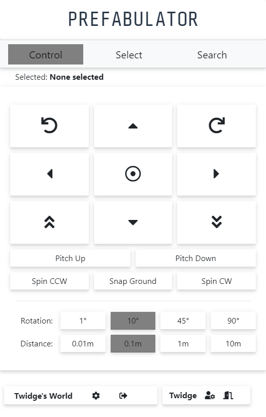

# attprefabulator

Add, remove and modify prefabs in A Township Tale

This browser based application gives a click-driven abstraction to the A Township Tale console's command set

### Download
You can download the latest (Windows) executable version of Prefabulator here:
https://github.com/edencomputing/attprefabulator/releases/

<a href="https://github.com/edencomputing/attprefabulator/releases/"></a>

### Release Notes
- v1.1.6 - Added selection history dropdown, added search to Select -> Find Nearby tool

- v1.1.5 - Added teleporting, server messages, player spawn/post tool and player administration tool

- v1.1.1 - Changed default port to 21129 to avoid issues with other software.  Fixed player config controls.  Added options to configure other players on the server

- v1.1.0 - Made prefabulator an electron app!

- v1.0.4 - Added player config, currently only for the tool user's player

- v1.0.2 - Added some server configuration options

- v1.0.1  - Should support multiple people using it on the same server without select collision

- v1.0.0  - The first version!  PREFABULATOR supports spawning new objects, moving them around, finding nearby objects, and selecting the nearest object of a specific kind

#### Known issues:
- ~~can only be used by one person at a time on each server, one person selecting items breaks the other player's selections~~


## Usage 

It's recommended to use the latest release version found here:
https://github.com/edencomputing/attprefabulator/releases/

Simply download the version for your operating system, extract the files, and run attPrefabulator

### Running from source

First, install node.js, recommend version 12 LTS

- https://nodejs.org

Next, install git

- https://git-scm.com/downloads

At this point, restart your PC to make sure the PATH is correctly set

Open a command prompt or terminal and type

```
git clone https://github.com/edencomputing/attprefabulator.git

cd attprefabulator/
```

Install the necessary node dependencies to run the app using the **npm** command
```
npm i
```

Start up the application with
```
npm start
```

If you'd like to run this headless as a server, you can alternately run
```
npm run server
```

In this mode, you should set the environment variable USE_SAVED_PASS=0 to prevent setting default credentials, eg:
```
USE_SAVED_PASS=0 npm run server
```

Finally, browse to the app with your favorite web browser, at:

- http://localhost:8000


Login using your A Township Tale user and password, select a server you're currently playing on, and wave the console command line goodbye!
